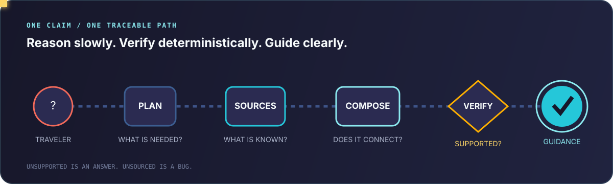
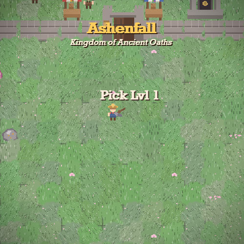
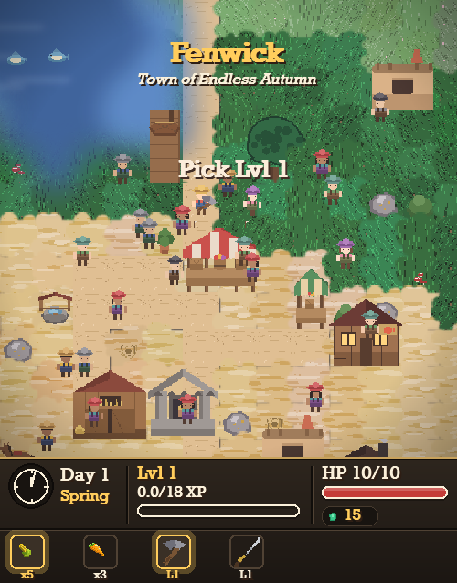
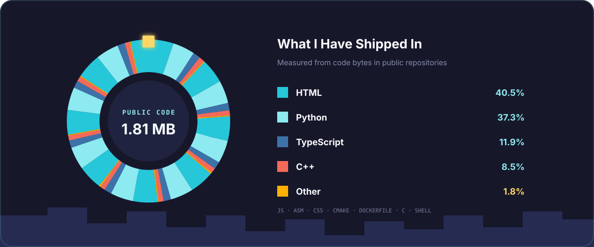
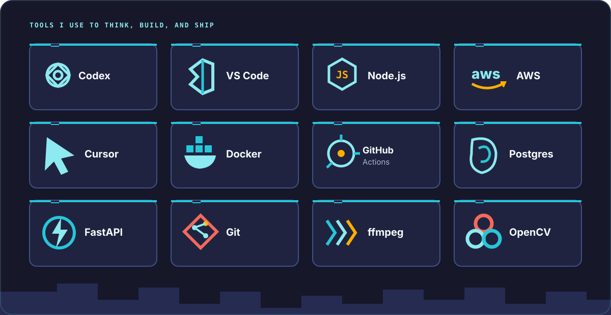

 

I am a product engineer, indie builder, and future engineering and computer science student. I am interested in what happens when software leaves the demo and has to become dependable: when the interface must make sense, the backend must survive real input, and an AI system has to admit what it does not know.

I like owning the whole path. I will move from product decisions to schemas, APIs, model behavior, native UI, infrastructure, and the tiny visual detail that makes the finished thing feel alive. That range is not an excuse to be shallow. It is how I understand whether the pieces actually belong together.

My curiosity wanders through **AI, cybersecurity, engineering, defence, software, finance, games, and creative tools**. The common thread is systems: how they behave, where they fail, and how thoughtful design can make something complicated feel obvious.

> I want to build serious technology without sanding away the joy that made me start building.

<table>
<tr>
<td width="33%" valign="top"><strong>What I Care About</strong>  Trustworthy systems Clear product decisions Craft people can feel</td>
<td width="33%" valign="top"><strong>How I Learn</strong>  Build the full path Test the uncomfortable edge Understand the failure</td>
<td width="33%" valign="top"><strong>What I Am Chasing</strong>  Useful AI Calm interfaces A little bit of magic</td>
</tr>
</table>

### `01 /` The Route Between the Routes

[Laneway](https://github.com/lanewayapp) is a Canada-first, native iOS navigation product for journeys ordinary maps cannot fully see.

Mapping systems are excellent when every path exists in their graph. The interesting failure begins at the missing edge: the unindexed airport shuttle, the walk through a terminal, the hotel van from an unsigned post, or the informal connection between two otherwise valid routes. A mapping app can return a technically possible answer that is practically useless because the real connection was never encoded.

Laneway adds those missing edges without pretending certainty. Its central promise is simple:

> **Never present a fact the system cannot back up.**

### `02 /` The Hard Case

Land at Toronto Pearson Terminal 1 and travel to an off-airport rental depot. The useful route might include an indoor level change, the LINK train, terminal navigation, an operator shuttle from a particular post, and a final walk. Several of those edges do not exist in conventional road or transit data. Without them, the answer degrades into a long perimeter walk or a driving route for someone who does not yet have a car.

Laneway is designed around that kind of trip, not around the easy route that every map already solves.

### `03 /` Trust Is a Product Feature

Every factual claim carries its source and fetch time. Verification is allowed to return **supported**, **contradicted**, or **unsupported**. When sources fail, the route becomes partial and names the unknown leg. When sources conflict, the conflict is visible. When cached information is used, its age is visible.

That creates a different relationship with AI. The model can reason, but it cannot quietly turn plausibility into fact.

<table>
<tr>
<td width="33%" valign="top">

#### Plan

Understand the trip, its physical constraints, time window, preferred modes, and budget. Select one defensible route instead of handing the research back to the traveler.

</td>
<td width="33%" valign="top">

#### Verify

Trace every claim to retrieved evidence. Keep live observations separate from durable facts. Preserve “I could not verify this” as a valid result.

</td>
<td width="33%" valign="top">

#### Navigate

Turn the verified plan into the surface people live in: a native iOS experience, saved offline, with leg-level confidence and source-backed guidance.

</td>
</tr>
</table>

### `04 /` How It Is Built

`Swift` `SwiftUI` `Python` `FastAPI` `PostgreSQL` `Redis` `Google Routes` `GTFS` `Anthropic`

The architecture separates a slower reasoning loop from fast deterministic execution. Intake structures the request; planning identifies the needed information; retrieval checks APIs, feeds, and published sources; composition checks whether legs connect in time; verification settles each claim; presentation keeps the evidence visible. Cache checks happen before retrieval or model work, and live data is never allowed to masquerade as a durable fact.

I contribute across the product: engine behavior, native interface, verification surfaces, mobility features, and the engineering details that keep the story honest from API response to screen.

###  Shinobi

[Shinobi](https://github.com/emilio-martin1208/shinobi) asks a practical creative question: how much of the repetitive work between a long video and a finished short can software handle well?

It transcribes footage, finds promising moments, cuts and reformats them for vertical video, follows faces, renders animated word-level subtitles, and prepares titles, descriptions, and tags. The interesting part is not calling a model. It is the media pipeline around the model: timing, crops, rendering, fallbacks, and turning a suggestion into an artifact someone can publish.

`Python` `FastAPI` `Claude` `Whisper` `ffmpeg` `OpenCV`

<strong>Open the Shinobi workspace</strong>

 

###  Forge

[Forge](https://github.com/emilio-martin1208/forge) is repository intelligence for coding agents. It builds a deterministic picture of a codebase: languages, frameworks, routes, features, dependencies, and health. That grounded model becomes documentation, reviews, architecture context, and better inputs for tools such as Codex and Cursor.

The thesis is that an agent should not have to hallucinate the shape of a repository before it can help. Context should be assembled from the code, made inspectable, and reused.

`TypeScript` `Next.js` `NestJS` `Prisma` `PostgreSQL` `Redis`

###  Arborio

[Arborio](https://github.com/emilio-martin1208/arborio) is where the childlike part gets the whole screen. It is a farming RPG built from scratch in Python without a game engine: procedural biomes, villages, walled kingdoms, an underworld, combat, boats, production chains, base building, and a code-generated pixel-art pipeline.

It began as a small farm and kept becoming a world. Arborio taught me that technical depth and play are not opposites. Sometimes a world-generation algorithm is also a story machine.

`Python` `Pygame` `Pillow` `Procedural Generation`

&nbsp;

 

<table>
<tr>
<td width="50%" valign="top"><strong><a href="https://github.com/emilio-martin1208/retro-racer">Retro Racer</a></strong>  An early-2000s-style arcade racing experiment in C++ and raylib.</td>
<td width="50%" valign="top"><strong><a href="https://github.com/emilio-martin1208/mini8">mini8</a></strong>  Small systems and graphics experiments, kept intentionally close to the metal.</td>
</tr>
</table>

Calculated from GitHub's language-byte totals across my public repositories. This shows the composition of the code I have published, not a ranking of proficiency. Updated September 2026.

I am early in the journey and serious about where it can go. If you are building something useful, strange, technically difficult, or all three, I would genuinely like to hear about it.

<strong>Let the contribution creature out</strong>

 
<picture>
  <source media="(prefers-color-scheme: dark)" srcset="https://raw.githubusercontent.com/emilio-martin1208/emilio-martin1208/output/github-contribution-grid-snake-dark.svg" />
  <source media="(prefers-color-scheme: light)" srcset="https://raw.githubusercontent.com/emilio-martin1208/emilio-martin1208/output/github-contribution-grid-snake.svg" />
  
</picture>

