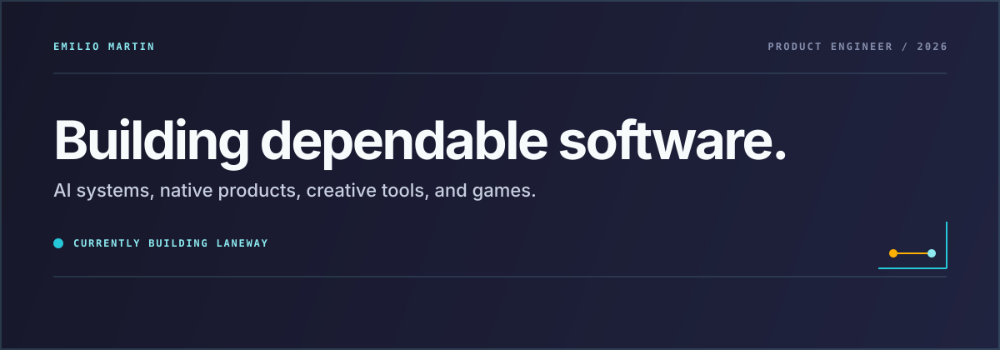
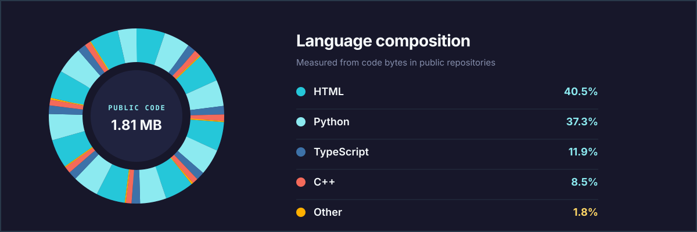

I build end-to-end products: product direction, interfaces, APIs, model behaviour, infrastructure, and the details that make a system feel considered. I care about trustworthy AI, calm interfaces, and software that holds up outside the demo.

## Co-Founding Growth

### [Laneway](https://lanewayapp.github.io)

Canada-first navigation for journeys that ordinary maps miss. Laneway connects the real-world edges between routes—terminal navigation, airport shuttles, hotel vans—while showing what the system can and cannot verify.

`Swift` `SwiftUI` `Python` `FastAPI` `PostgreSQL` `Redis` `Anthropic`

## Selected projects

| Project | What it does | Stack |
| --- | --- | --- |
| [Shinobi](https://github.com/emilio-martin1208/shinobi) | Turns long-form video into vertical, subtitled clips. | Python · FastAPI · Whisper · ffmpeg |
| [Forge](https://github.com/emilio-martin1208/forge) | Repository intelligence and grounded context for coding agents. | TypeScript · Next.js · NestJS · Prisma |
| [Arborio](https://github.com/emilio-martin1208/arborio) | A procedural farming RPG, built from scratch without an engine. | Python · Pygame · Pillow |
| [Retro Racer](https://github.com/emilio-martin1208/retro-racer) | Early-2000s arcade racing experiment. | C++ · raylib |

## Tool Box

## Languages

Calculated from public GitHub language-byte totals. It describes published code, not proficiency. Updated September 2026.

## Contact

