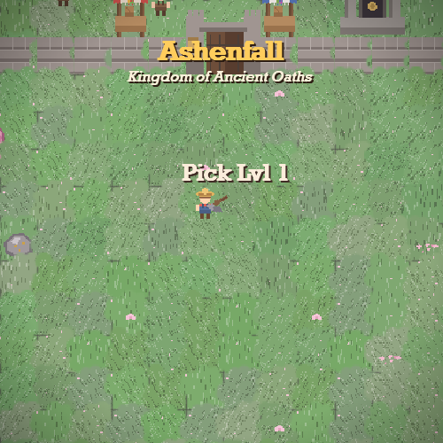
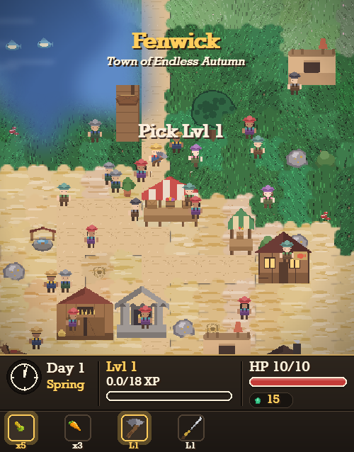

 

## About

I am a product engineer and indie builder interested in what happens when software leaves the demo and has to become dependable: the interface must make sense, the backend must survive real input, and an AI system has to admit what it does not know.

I work across product decisions, schemas, APIs, model behaviour, native UI, infrastructure, and the details that make a finished system feel considered. My interests include AI, cybersecurity, software, finance, games, and creative tools; the common thread is systems—how they behave, where they fail, and how design can make complexity feel obvious.

> Building serious technology with clarity, care, and a little sense of wonder.

## Current work — Laneway

[Laneway](https://github.com/lanewayapp) is a Canada-first native iOS navigation product for journeys ordinary maps cannot fully see.

Mapping tools work when every connection exists in their graph. The hard case is the missing edge: an unindexed airport shuttle, terminal navigation, a hotel van, or an informal connection between otherwise valid routes. Laneway adds those edges without pretending certainty.

> **Never present a fact the system cannot back up.**

Every factual claim carries its source and fetch time. Verification can return **supported**, **contradicted**, or **unsupported**; a partial route names the unknown rather than hiding it. The product separates slower reasoning from fast deterministic execution, keeping live data distinct from durable facts.

`Swift` `SwiftUI` `Python` `FastAPI` `PostgreSQL` `Redis` `Google Routes` `GTFS` `Anthropic`

## Selected work

### [Shinobi](https://github.com/emilio-martin1208/shinobi)

Shinobi turns one long-form video into vertical, subtitled clips. It transcribes, finds promising moments, follows faces, renders word-level captions, and produces platform-ready metadata. The interesting work is the media pipeline around the model: timing, crops, rendering, fallbacks, and making a suggestion into a publishable artifact.

`Python` `FastAPI` `Claude` `Whisper` `ffmpeg` `OpenCV`

<strong>View the Shinobi workspace</strong>

 

### [Forge](https://github.com/emilio-martin1208/forge)

Forge gives coding agents a deterministic understanding of a repository: languages, frameworks, routes, features, dependencies, and health. That grounded model becomes documentation, reviews, architecture context, and better inputs for coding agents.

`TypeScript` `Next.js` `NestJS` `Prisma` `PostgreSQL` `Redis`

### [Arborio](https://github.com/emilio-martin1208/arborio)

Arborio is a farming RPG built from scratch in Python without a game engine: procedural biomes, villages, walled kingdoms, an underworld, combat, boats, production chains, base building, and a code-generated pixel-art pipeline.

`Python` `Pygame` `Pillow` `Procedural Generation`

&nbsp;

 

<table>
<tr>
<td width="50%" valign="top"><strong><a href="https://github.com/emilio-martin1208/retro-racer">Retro Racer</a></strong>  An early-2000s-style arcade racing experiment in C++ and raylib.</td>
<td width="50%" valign="top"><strong><a href="https://github.com/emilio-martin1208/mini8">mini8</a></strong>  Small systems and graphics experiments, kept intentionally close to the metal.</td>
</tr>
</table>

## Language composition

Calculated from GitHub language-byte totals across public repositories. It describes published code, not proficiency. Updated September 2026.

## Contact

If you are building something useful, strange, technically difficult, or all three, I would like to hear about it.

